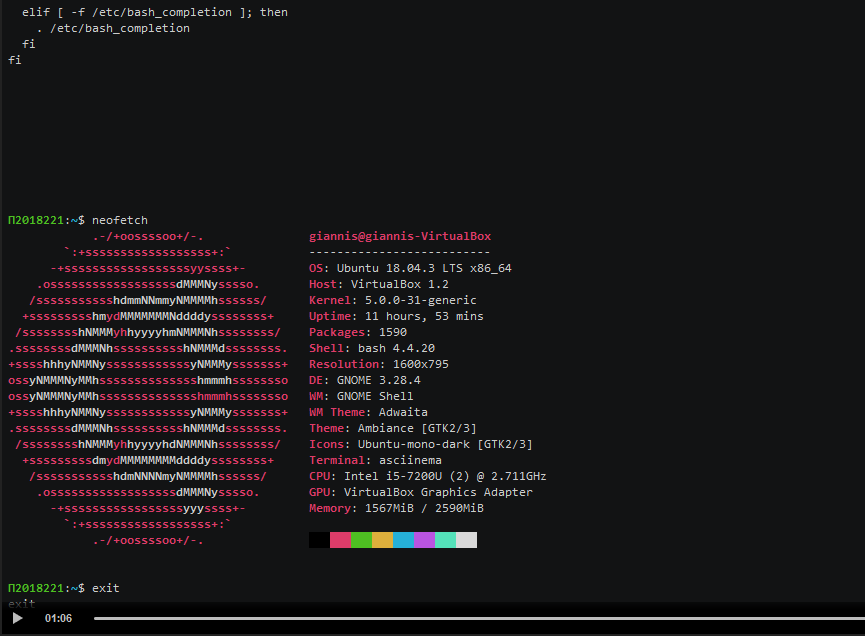
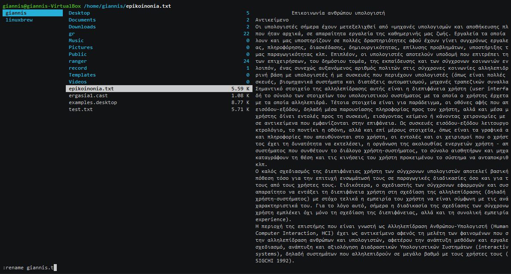

# ΕΠΙΚΟΙΝΩΝΙΑ ΑΝΘΡΩΠΟΥ ΥΠΟΛΟΓΙΣΤΗ 
#        ΤΕΛΙΚΗ ΑΝΑΦΟΡΑ

### Αριθμός Μητρώου: Π2018221
### Ονοματεπώνυμο: Μυρώνης Ιωάννης
### [Προφίλ στο github](https://github.com/p18myro 'Προφίλ στο github')

# Τίτλος
Ανάπτυξη βασικών δεξιοτήτων LInux και υλοποίηση εργασιών συμμετοχικού περιεχομένου

# Σύνοψη
Το κείμενο αυτό αποτελεί την τελική μου αναφορά για τις εργασίες που εκπονήθηκαν κατά  την  διάρκεια του μαθήματος  επικοινωνία ανθρώπου υπολογιστή του τρίτου εξαμήνου του τμήματος ΠΛηροφορικής του Ιονίου Πανεπιστημίου. Η εργασία αποτελείται  από δύο παραδοτέα κάθε ένα εκ των οποίων  περιέχει  μία εργασία συμμετοχικού υλικού και  δυο ασκήσεις σε Linux. Η ανάπτυξη των εργασιών έγινε με χρήση Linux, HTML ,CSS και JavaScript.

#  Σύντομη Εισαγωγή
Για την υλοποίηση των εργασιών εγκαταστάθηκε μέσω της εφαρμογής virtual box λειτουργικό σύστημα Linux  (UBUNTU 1804_lts).  Σκοπός της εργασίας ήταν η εξοικείωση με τις βασικές εντολές του Linux  καθώς και η χρήση applications όπως το Calcurse,VIm και το Todo.txt_CLI. Η καταγραφή των video που παρουσιάζουν την εκτέλεση της εργασίας έγινε με την χρήση του Asciinema,ενός online εργαλείου που κάνει capture το τερματικό του Linux. Η πραγματοποίηση και η υποβολή των παραδοτέων έγινε μέσω της πλατφόρμας του Github. Τέλος για την διεκπεραίωση της εργασίας των δύο διαδραστικών παραδειγμάτων έγινε χρήση του codepen.io

#  Σύντομη ανάλυση σχετικών έργων και εργαλείων
Στην πρώτη εργασία εγκατέστησα τον editor nano και μέσω αυτού και του vi editor έδειξα πως μπορώ να αλλάξω με  2 διαφορετικούς τρόπους  το prompt του bashrc. Επίσης εγκατέστησα το neofetch και είδα τις πληροφορίες του συστήματος. Στην δεύτερη εργασία εγκατέστησα τον editor Vim και είδα πως μπορώ να τροποποιήσω ένα αρχείο. Εγκατέστησα της εφαρμογή Ranger  και είδα την ευκολία που προσφέρει στην διαχείριση αρχείων και φακέλων. Στην Τρίτη εργασία εγκατέστησα την εφαρμογή todo.txt CLI  και δημιούργησα μια λίστα εργασιών. Τέλος στην τέταρτη εργασία εγκατέστησα την εφαρμογή Calcurse και δημιούργησα  μια  λίστα  appointments και Todo's. Στην πρώτη εργασία συμμετοχικού περιεχομένου έκανα τις κατάλληλες τροποποιήσεις στο αρχείο \_congif.yml  καθώς και στους φακέλους  \_gallery (αρχεία Altair 8800 Computer.md, Apple II.md, Eniac computer 1946.md, IBM system360.md και Τransistorized computer 1401 IBM.md) και  images (αρχεία Altair 8800 Computer.jpg, Altair 8800 Computer-thumb.jpg, Apple II.jpg, Apple II-thumb.jpg, Eniac computer 1946.jpg, Eniac computer 1946-thumb.jpg, IBM system360.jpg, IBM system360-thumb.jpg, Τransistorized computer 1401 IBM.jpg και Τransistorized computer 1401 IBM-thumb.jpg)  ώστε να φτιάξω το εκτελέσιμο μου και να προσθέσω 5 νέες φωτογραφίες στο βιβλίο του μαθήματος. Στην δεύτερη εργασία που αφορούσε την τροποποίηση  2 διαδραστικών παραδειγμάτων χρησιμοποίησα  το codepen.io και έκανα τις κατάλληλες αλλαγές στα 2 παραδείγματα της επιλογής μου(switch.md, audio-player.md) που βρίσκονται στον φάκελο \_remix.
# Μέθοδος και τεχνικές ανάπτυξης
Στην εργασία συμμετοχικού  για την τροποποίηση των διαδραστικών παραδειγμάτων έγινε χρήση του codepen.io. Στο πρώτο παράδειγμα άλλαξα την  τιμή της μεταβλητής trackid του κώδικα JavaScript  δίνοντας της το νέο  trackid του τραγουδιού που επέλεξα. Το  trackid του νέου τραγουδιού το βρήκα μέσω του soundcloud.com.  Στο δεύτερο παράδειγμα  τροποποίησα  τον  κώδικα html βάζοντας ετικέτα (label) που εμφανίζει το μήνυμα «LIGHT ON». Ακολούθως έφτιαξα το css  της ετικέτας με αρχική τιμή none για την ιδιότητα display ώστε  αρχικά  να μην εμφανίζεται  το μήνυμα.Με κάθε κλικ πάνω στο κουμπί καλείται  η συνάρτηση test.Η συνάρτηση αυτή χρησιμοποιεί την μεταβλητή tongle σαν σημαία ώστε να εμφανίζεται ή να αποκρύπτεται η ετικέτα, αλλάζοντας την μεταβλητή tongle σε 0 ή 1,  καθώς και την τιμή της ιδιότητας display της ετικέτας από none σε inline. Το πρόβλημα που υπήρχε με την δημιουργία του εκτελέσιμου μέσω  του Github pages, επιλύθηκε  αλλάζοντας το tag "include_relative" στα αρχεία που το περιείχαν, με το tag "include". Εν συνεχεία μετέφερα το σύνολο των αρχείων .md που δείχνει το tag "include" στο directory \_includes. Τέλος για την επίλυση διάφορων προβλημάτων που προέκυψαν  κατά την εγκατάσταση των εφαρμογών που χρησιμοποίησα για τις εργασίες που πραγματοποίησα μέσω Linux βρήκα online αναφορές κυρίως μέσω του geeksforgeeks.org 

# Αποτελέσματα με λεζάντες σε ενδεικτικές οθόνες

## Παραδοτέο 1
### [Σύνδεσμος αποθετηρίου hci](https://github.com/p18myro/hci 'Σύνδεσμος αποθετηρίου ') 

## Εργασία 1: Set-up the main dependencies and demonstrate your base system 
  Αρχικά έγινε εγκατάσταση στο ubuntu των εφαρμογών neofetch, python 3 και του asciinema με την βοήθεια του οποίου γίνεται η εγγραφή ενός αρχείου τύπου (.cast). Ακολούθως μέσω του ιστιότοπου asciinema.org μας δίνεται το link του παραδοτέου.  

### Εκπλήρωση ζητούμενων πρώτης εργασίας
* [x] Άλλαξα το prompt με την βοήθεια του editor nano και εν συνεχεία ακολουθώντας μια διαφορετική διαδικασία μέσω του editor vi.
* [x] Εμφάνιση των κρυφών αρχείων μέσω της εντολής ls -la
* [x] Εμφάνιση των περιεχομένων του αρχείου παραμέτρων του κέλυφους(shell) μέσω των εντολών less και more
* [x] Εμφάνιση των πληροφοριών του συστήματος μεσώ της εφαρμογής neofetch 

### Τεκμηρίωση ζητουμένων
#### [Σύνδεσμος Παραδοτέου εργασία 1](https://asciinema.org/a/275434)

## Εργασία 2: Get familiar with basic commands, reading documentation and editing files
Έγινε εγκατάσταση στο ubuntu του Vim editor, του file manager ranger καθώς και της εφαρμογής the fuck. Αρχικά είδαμε μερικές απο τις βασικές εντολες του linux καθώς και πως κάνουμε διόρθωση και επεξεργασία ενός αρχείου με την βοήθεια του editor vim. Στην συνέχεια περιηγηθήκαμε στους φακέλους και τα αρχεία του υπολογιστή μέσω του συστήματος διαχείρησης φακέλων ranger και τέλος είδαμε πως λειτουργεί η εφαρμογή the fuck.

### Εκπλήρωση ζητούμενων δεύτερης εργασίας
* [x] Εξοικείωση με τις βασικές εντολές του linux όπως whoami,ls,less,cat,cp κ.α
* [x] Χρήση της εντολής man για καλύτερη γνώση όλων των παραμέτρων της κάθε εντολής.
* [x] Εξοικείωση με τον editor vim (copy,paste,undo,redo,search).
* [x] Διαχείρη των αρχείων του υπολογιστη με την εφαρμογή ranger. Μέσω του ranger μας δίνεται η δυνατότητα για εύκολη και γρήγορη περιήγηση και διαχείριση στους φακέλου και τα αρχεία του συστήματος, καθώς και χρήση πολλών tabs. 
* [x] Χρήση της εφαρμογής διόρθωσης σφαλμάτων The fuck και των επιλογών που δίνει αυτή.

### Τεκμηρίωση ζητουμένων
#### [Σύνδεσμος Παραδοτέου εργασία 2](https://asciinema.org/a/278979)

## Εργασία Συμμετοχικού περιεχομένου
## Παραδοτέο Α
Προσθήκη πέντε φωτογραφιών στο αντίγραφο του βιβλίου του μαθήματος. 

### [Σύνδεσμος αποθετηρίου GR](https://github.com/p18myro/gr 'Σύνδεσμος αποθετηρίου')
### [Σύνδεσμος εκτελέσιμου](https://p18myro.github.io/gr/)

### Σύνδεσμος Πρώτης εικόνας:
### [Eniac computer 1946](https://p18myro.github.io/gr/gallery/Eniac%20computer%201946/)

### Σύνδεσμος δεύτερης εικόνας:
### [Τransistorized computer 1401 IBM](https://p18myro.github.io/gr/gallery/%CE%A4ransistorized%20computer%201401%20IBM/)

### Σύνδεσμος τρίτης εικόνας:
### [IBM system360](https://p18myro.github.io/gr/gallery/IBM%20system360/)

### Σύνδεσμος τέταρτης εικόνας:
### [Altair 8800 Computer]( https://p18myro.github.io/gr/gallery/Altair%208800%20Computer/)

### Σύνδεσμος πέμπτης εικόνας:
### [Apple II](https://p18myro.github.io/gr/gallery/Apple%20II/)

## Παραδοτέο 2
### [Σύνδεσμος αποθετηρίου hci](https://github.com/p18myro/hci 'Σύνδεσμος αποθετηρίου ') 

## Εργασία 3: Become productive with a todo list
  Αρχικά έγινε download και εγκατάσταση το todo.txt CLI. Στην συνέχεια έγινε προσθήκη της γραμμής alias t='~/todo.sh' στο κέλυφος(bashrc) ώστε κατα την χρήση της λίστας να χρησιμοποιούμε το γράμμα t αντι του todo.sh.
  
### Εκπλήρωση ζητούμενων τρίτης εργασίας
* [x] Δημιουργία λίστας
* [x] Δήλωση προτεραιότητας εργασειών λίστας
* [x] Επεξεργασία και διαγραφή περιεχομένων λίστας
 

### Τεκμηρίωση ζητουμένων
#### [Σύνδεσμος Παραδοτέου εργασία 3](https://asciinema.org/a/281449)

## Εργασία 4: Plan your time with a calendar
  Αρχικά έγινε download και εγκατάσταση το Calcurse. Στην συνέχεια έγινε παραμετροποίηση του Calcurse.
  
### Εκπλήρωση ζητούμενων τέταρτης εργασίας
* [x] Δημιουργία λίστας appointments και Todo's
* [x] Επεξεργασία λίστας appointments (Δημιουργία επαναλαμβανόμενων συναντήσεων)
* [x] Επεξεργασία και διαγραφή περιεχομένων appointments και λίστας(εισαγωγή δεδομένων απο εξωτερικό αρχείο)
* [x] Αναζήτηση περιεχομένων appointments και λίστας απο την γραμμή εντολών
* [x] Εξαγωγή δεδομένων Calcurse και αποθήκευση τους σε αρχείο .dat
 

### Τεκμηρίωση ζητουμένων
#### [Σύνδεσμος Παραδοτέου εργασία 4](https://asciinema.org/a/285892)

## Εργασία Συμμετοχικού περιεχομένου

## Παραδοτέο Β
 Δημιουργία δύο νέων διαδραστικών παραδειγμάτων, τα οποία θα πρέπει να συνδέονται με βασικές έννοιες του βιβλίου και της διάδρασης ανθρώπου-υπολογιστή και να επιτρέπουν σε κάποιον 2ο χρήστη να τα αλλάξει ή/και να τα προσθέσει σε διαφορετικές εφαρμογές ως αρχέτυπα.
 
### [Σύνδεσμος αποθετηρίου GR](https://github.com/p18myro/gr)
### [Σύνδεσμος εκτελέσιμου](https://p18myro.github.io/gr/)

### Σύνδεσμοι διαδραστικών παραδειγμάτων:

### Παράδειγμα 1
### [Σύνδεσμος αποθετήριου audio-player](https://github.com/p18myro/gr/blob/gh-pages/_remix/audio-player.md)
### [Σύνδεσμος διαδραστικού παραδειγμάτος audio-player](https://p18myro.github.io/gr/remix/audio-player/)

### Παράδειγμα 2
### [Σύνδεσμος αποθετήριου switch ](https://github.com/p18myro/gr/blob/gh-pages/_remix/switch.md)
### [Σύνδεσμος διαδραστικού παραδειγμάτος switch](https://p18myro.github.io/gr/remix/switch/)

## Συμπεράσματα
Η εργασία  στο μάθημα HCI βοήθησε  στην απόκτηση δεξιοτήτων  που αφορούν το  λειτουργικό σύστημα Linux και τις τεράστιες δυνατότητες που παρέχει στους  χρήστες ,  καθώς  και  στην  εκμάθηση γλωσσών προγραμματισμού όπως η HTML, JavaScript και CSS. Επίσης μάθαμε να χειριζόμαστε την πλατφόρμα Github η οποία αποτελεί ένα ισχυρό εργαλείο για την δημιουργία μεγάλων projects, όπου η ομαδική συνεισφορά κρίνεται αναγκαία για την ολοκλήρωση τους. Τέλος, μέσω των δύο εργασιών συμμετοχικού περιεχομένου συνεισφέραμε στον εμπλουτισμό του βιβλίου του μαθήματος.

## Επιπλέον Εργασία Συμμετοχικού περιεχομένου αντι εξεταστικής Σεπτεμβρίου
## Παραδοτέο Γ

Δημιουργία βιογραφικού

Για την διεκπαιρέωση του παραδοτέου Γ έφτιαξα το βιογραφικό του Douglas Engelbart. Κάνοντας έρευνα στο διαδίκτυο συνέθεσα το βιογραφικό και ακολούθος δημιούργησα το αρχείο bio-Engelbart.md το οποίο και πρόσθεσα  στον κατάλογο /_biography, του αποθετηρίου και το Douglas-Engelbart.md το οποίο και πρόσθεσα  στον κατάλογο /_biography και /_Includes του αποθετηρίου. Τέλος πρόσθεσα στον κατάλογο /images τρεις εικόνες και τα αντίστοιχα εικονίδιά τους (thumb).

### [Σύνδεσμος αποθετηρίου GR](https://github.com/p18myro/gr 'Σύνδεσμος αποθετηρίου')
### [Σύνδεσμος εκτελέσιμου](https://p18myro.github.io/gr/)

### Σύνδεσμος Βιογραφικού:
### [Douglas Engelabart](https://p18myro.github.io/gr/biography/Douglas-Engelbart/)

